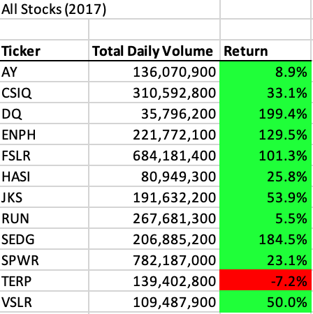
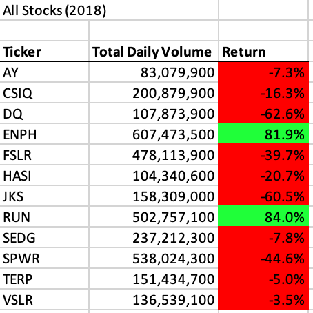

# VBA of Wall Street

## Overview of Project
The purpose of this project was to creata a VBA script which analyzed the stock return percentage and total daily volume traded for a specific subset of stocks for a given year. My (hypothetical) client had a particular interest in one green energy company, in which his parents were considering investing. However, he was concerned that investing everything in a single company might not be a wise decision. To confirm his suspicions, my client asked for an easy way of comparing the stock return percentage for the years 2017 and 2018 for the company his parents were interested in, as well as a group of comparable green energy companies.

Once this script was created, it was determined that while the script ran efficiently when comparing the volume and return percentages for a set of 12 stocks, it might not be as quick when asked to run the analysis on a much larger data set, say, all publicly traded stocks in a given year. The second phase of this project involved refactoring the code to find a more efficient way of scanning through the daily volume and stock prices for each stock and generating the percent return from the ending price compared to the stock's starting price.

## Results

### Initial Code 
In order to generate the the return percentage comparison for year's worth of stock prices, I first needed to create code that would recognize the individual stock tickers. To do this, I created an array which defined an index for each of the 12 tickers:

```
   ' Initialize array of all tickers
   Dim tickers(12) As String
   tickers(0) = "AY"
   tickers(1) = "CSIQ"
   tickers(2) = "DQ"
   tickers(3) = "ENPH"
   tickers(4) = "FSLR"
   tickers(5) = "HASI"
   tickers(6) = "JKS"
   tickers(7) = "RUN"
   tickers(8) = "SEDG"
   tickers(9) = "SPWR"
   tickers(10) = "TERP"
   tickers(11) = "VSLR"
   ```
After setting variables for the starting price and ending price of the stocks, as well as defining a variable for the end row count, I then created a loop for the code to loop through all the tickers within the array, through all the rows within the dataset: 
   
   ```  
   ' Loop through tickers
   For i = 0 To 11
       ticker = tickers(i)
       totalVolume = 0
       
       ' Loop through rows in the data
   Sheets(yearValue).Activate
       For j = 2 To RowCount
   ```
   Once the loop was set, I then created a series of If statements to get the starting price and ending price for each ticker:
   
   ```
   ' Get total volume for current ticker
           If Cells(j, 1).Value = ticker Then

               totalVolume = totalVolume + Cells(j, 8).Value

           End If
           ' Get starting price for current ticker
           If Cells(j - 1, 1).Value <> ticker And Cells(j, 1).Value = ticker Then

               startingPrice = Cells(j, 6).Value

           End If

           'Get ending price for current ticker
           If Cells(j + 1, 1).Value <> ticker And Cells(j, 1).Value = ticker Then

               endingPrice = Cells(j, 6).Value
 ```
 The output of these statments was the total daily volume as well as the return percentage (endingPrice / startingPrice - 1) for each ticker. The analysis was done for both 2017 and 2018 utilizing the same code by adding in a yearValue statement to the start of my script which allows the user to define for which year the analysis should be run.
 
 ### Stock Analysis
 With the output of this script, I was able to compare the stock return for the company my client was interested in against the subset of similar companies for both the years 2017 and 2018. 
 
 Here's the analysis for 2017:
 
 
 This was a high performing year for green energy companies in general. It's no wonder my client's parents were interested in investing in DQ stock, given that it had the highest return of all the companies 2017 at 199.4%. Additionally, it had the lowest overall volume traded of all companies, suggesting that there was room to enter the market and make a profit on this stock. Only one company, TERP, saw a negative return in 2017, suggesting that investing in this industry would be a relatively safe decision. 
 
 However, it was a good idea for my client to suggest that we compare multiple years' of data to see how returns compared year over year. After running the same analysis for 2018, the results looked quite different. 
 
 Here's the analysis for 2018:
 
 
 2018 was comparatively a much lower-performing year for these green energy companies. While the volume of stock traded for DQ increased in 2018, the return decreased dramatically, seeing a negative overall return of -62.6% for the year. TERP, the company with the lowest performing stock in 2017, continued to have a negative return in 2018. TERP seems like a safe option to rule out for investing based on this data. And while DQ seemed promising in 2017, the 2018 data shows that solely investing in DQ stock may not yield the return my client's parents were anticipating. Instead, ENPH and RUN stock seem like the best options, given that they were the only companies in this group to show a positive return in 2018, and a healthy one, too, at over 80% for both. Both companies had positive returns in 2017 as well. 
 
 The most compelling company to invest in based on this data is RUN, which had a modest 5.5% return in 2017 but increased to an 84% return in 2018. But knowing that returns can look quite different year over year, it would likely still be a good idea to spread investments across multiple companies.
 
 ### Refactored Code 
 While this intial script generated the information I was looking for, reviewing the code suggested that the speed in which the code runs could be impacted if more tickers were added to the analysis. The main issue here was that the loop statement included nested loops, which caused the code to run over every line in the data set to aggregate the volume and prices for each ticker. The refactored code adjusts the script to loop over all of the data only once, tallying the data for each ticker starting from 0 and moving through the index to complete the analysis for all tickers. 
 
The refactored code also incorporated more usage of variables to make the code easier to read, with less calls to specific rows and columns in the data set which would be difficult to interpret if the same code was applied to a new data set.

Here's an example of the refactored code which loops over all the rows only once:

```
' Create a ticker Index
     tickerIndex = 0

    ' Create three output arrays
    Dim tickerVolumes(12) As Long
    Dim tickerStartingPrices(12) As Single
    Dim tickerEndingPrices(12) As Single
    
    ' Create a for loop to initialize the tickerVolumes to zero.
    For i = 0 To 11
        tickerVolumes(i) = 0

Next i
        
    ' Loop over all the rows in the spreadsheet.
    Sheets(yearValue).Activate
    For i = 2 To RowCount
    
        ' Increase volume for current ticker
        tickerVolumes(tickerIndex) = tickerVolumes(tickerIndex) + Cells(i, 8).Value
        
        ' Check if the current row is the first row with the selected tickerIndex.
        If Cells(i - 1, 1).Value <> Cells(i, 1).Value Then
            tickerStartingPrices(tickerIndex) = Cells(i, 6).Value
        
        End If
        
        ' Check if the current row is the last row with the selected ticker
         'If the next row’s ticker doesn’t match, increase the tickerIndex.
        If Cells(i + 1, 1).Value <> Cells(i, 1).Value Then
            tickerEndingPrices(tickerIndex) = Cells(i, 6).Value
        
        End If

            ' Increase the tickerIndex.
           If Cells(i + 1, 1).Value <> Cells(i, 1).Value Then
                tickerIndex = tickerIndex + 1
            
            End If
        
     Next i
```
To determine just how much faster this refactored code runs, a Timer was added to the code which generated a message box with the overall time required to run the analysis from start to finish. This was added to both the old and new code to compare results. 

Original code run time:
